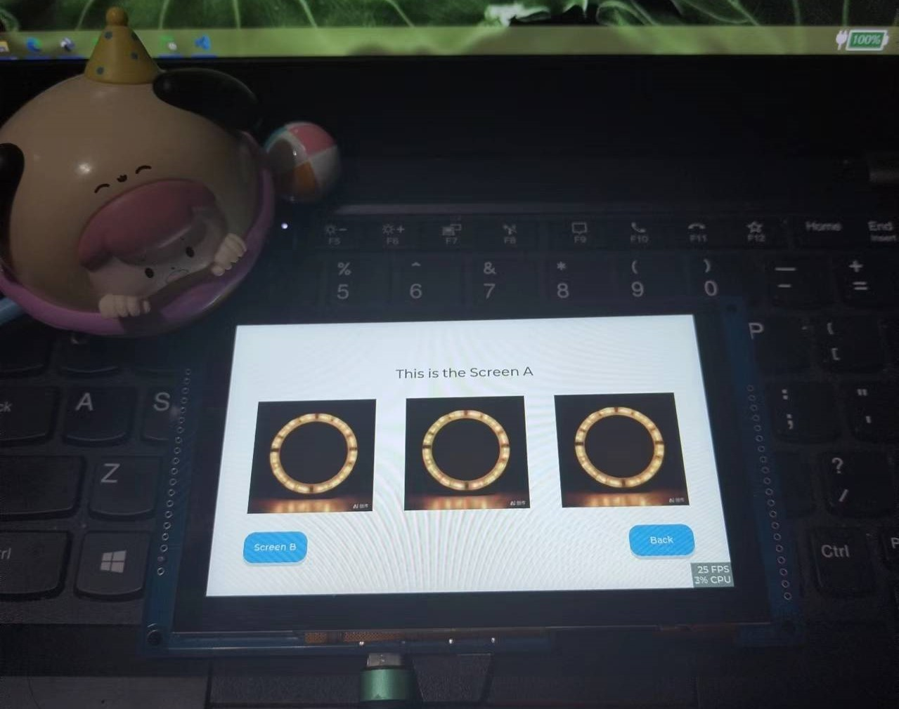
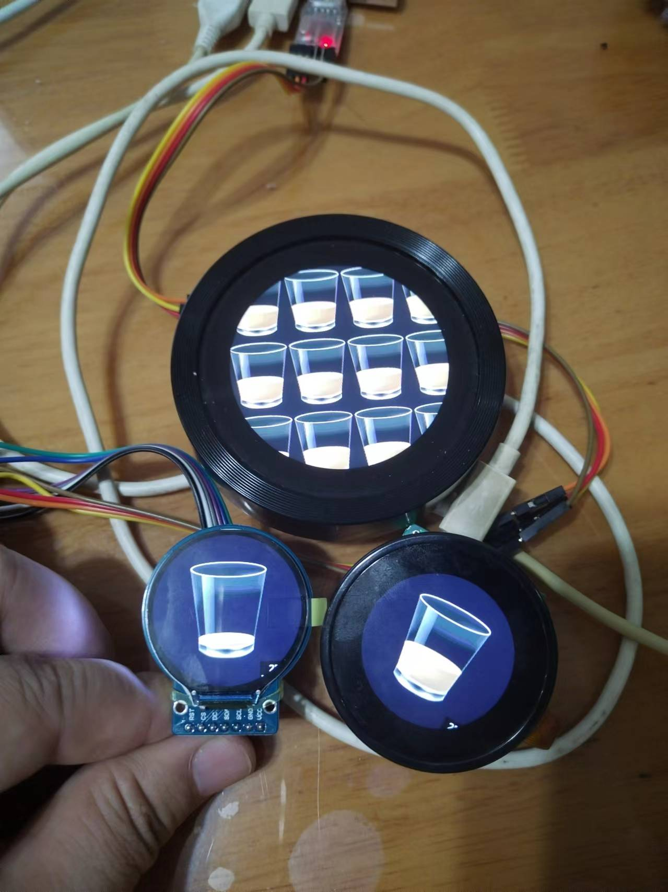
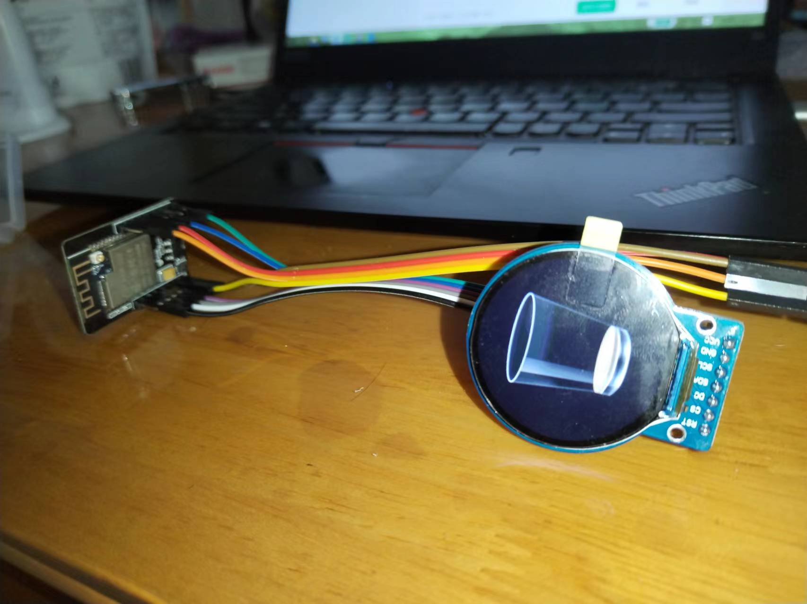

# esp-lvgl [中文版](https://github.com/airooter/esp-lvgl/blob/main/README_cn.md)

#### Introduction

This project aims to develop, test, and share LVGL project code on the ESP32 and ESP8266 platforms, providing related documentation tutorials for students, technicians, makers, and professionals, offering technical references and code examples.

The project is developed using C language and MicroPython, supporting development tools such as Arduino, PlatformIO, ESP-IDF, and Thonny.

By using development boards and project code, we provide intuitive LVGL program results to help users better understand and apply LVGL technology.

This project is synchronized and updated on both Gitee and Github.

#### Latest Content

###### 00. using Image buttons to build lvgl gui-  [code is here:](https://github.com/airooter/esp-lvgl/tree/main/ESP_Arduino_case/5inch_st7262_board_lvgl_Multi_Pages)

###### 0. using ESP32 to drive an SPI display and run the LVGL graphics library-  [code is here:](https://github.com/airooter/esp-lvgl/tree/main/ESP_Arduino_case/1.28inch_LCD_lvgl_GFX_driver_gc9a01_board)

We have used an ESP32-CAM board to drive an 1.28inch gc9a01 round LCD, and we also have driven two round LCD **VIEWE** esp32 board。

###### 1. Arduino Basics

-  [Arduino IDE: The Programming Tool for ](https://mp.weixin.qq.com/s/TkQT3FdRbCkaLZswKrsMrw)
- Github link included in the article
- **Arduino IDE Domestic Download**: [Baidu Netdisk Download: Extraction Code: 6688](https://pan.baidu.com/s/1a26dNOMuRdsQojYUlaiGWg?pwd=6688)

###### 2. Manual Installation Method for Arduino ESP32 Library

- **Detailed WeChat Official Account Article**: [Arduino-ESP32: Unleashing the Unlimited Potential of ESP32 in Arduino IDE Environment, with Quick Manual Installation Method](https://mp.weixin.qq.com/s/F676rOa4q0rTdAA0S5TTEg)
- **Arduino core for the ESP32 Domestic Netdisk Download**: [Extraction Code: 6688](https://pan.baidu.com/s/1wwIw3zKf_3XaCC82JdzRzA?pwd=6688)

###### 3. TFT_eSPI: Arduino IDE Compatible TFT Library

- Compatible with RP2040, STM32, ESP8266, and ESP32, etc.
- **WeChat Official Account Article**: [TFT_eSPI: Arduino IDE Compatible TFT Library for RP2040, STM32, ESP8266, and ESP32](https://mp.weixin.qq.com/s/FE1P6cMRpf8qMHzx_VDd7A)
- Github link included in the article

###### 4. GUIslice Library

- **WeChat Official Account Article**: [Creating Ideal Graphic User Interfaces for Smart Hardware: GUIslice, Perfect Graphic User Interface Solution for Arduino, Raspberry Pi, ESP32, and Other Platforms](https://mp.weixin.qq.com/s/RFG_fM8egNP1N_4Fsi7NLQ)
- Github link included in the article

#### Development Board Introduction

The variety of development boards is growing, and currently, the project includes the following development boards:

**5-inch Serial Screen Display Capacitive Screen with WiFi Bluetooth MCU ESP32-S3 LVGL Development Board** [Taobao Link](https://item.taobao.com/item.htm?abbucket=13&id=798848483330&ns=1&priceTId=213e37f817176722778368647ef13c&spm=a21n57.1.item.1.3add523ckCH6Eg)

**2.1-inch 480*480TFT Circular LCD Rotary Screen Smart Serial Screen with WiFi Bluetooth Module ESP32-C3**

[Taobao Link](https://item.taobao.com/item.htm?id=720034878786&spm=a1z10.1-c-s.w4023-23954068088.10.27ac1ecd8jserj)

#### Contributing

1. Fork this repository
2. Create a new Feat_xxx branch
3. Submit your code
4. Create a new Pull Request